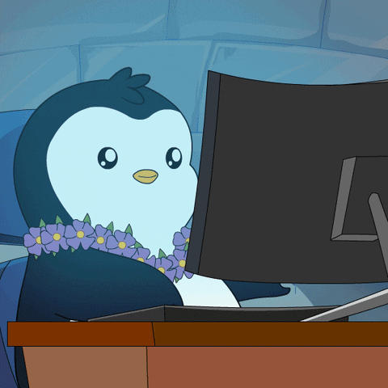

<!-- Heading -->
<h3 align="center"> Hello World! I'm Giovana Faria</h3>

<!-- Social Medias -->

  <a href="https://www.linkedin.com/in/giovana-faria/">Linkedin</a>

 <!-- About me section -->

 ----
 
 <!-- code gif-->

✨ I’m an engineer student, with a passion for software engineering and coding! Welcome to my GitHub!

Despite not being from the field, currently I’m immersing myself in the world of software development, as I have two years experience as an intern in the field. It’s been an exciting journey learning about microservices, database management, and API development.

- 📫 How to reach me: giovanafaria@hotmail.com.br

- ⚡ Fun fact: I am working on an API for my final graduation project that will receive dates and polygons and return the amount of water that area has lost or earn in the years. 

<!-- About section: END -->

<!-- Conecct section -->

----
<h2>Connect with me </h3>
    

        
   

 <!-- Conecct section: END -->

### 

<!--
**giovanafaria/giovanafaria** is a ✨ _special_ ✨ repository because its `README.md` (this file) appears on your GitHub profile.

Here are some ideas to get you started:

- 🔭 I’m currently working on ...
- 🌱 I’m currently learning ...
- 👯 I’m looking to collaborate on ...
- 🤔 I’m looking for help with ...
- 💬 Ask me about ...
- 📫 How to reach me: ...
- 😄 Pronouns: ...
- ⚡ Fun fact: ...
-->
